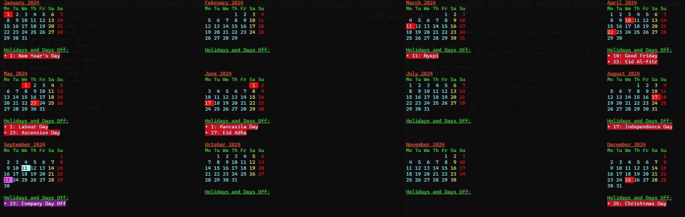

# Kalendar
Calendar with holiday and day off customize
    
## usage
edit holidays and day off on 'kalendar.ini' config file as you want then just run
```bash:
$ python kalendar.py
```

## example output


## requirements (pip)
- rich
- configset
- pydebugger (option for debug only)
    
## author
[Hadi Cahyadi](mailto:cumulus13@gmail.com)
    

[](https://www.buymeacoffee.com/cumulus13)

[](https://ko-fi.com/cumulus13)
 [Support me on Patreon](https://www.patreon.com/cumulus13)